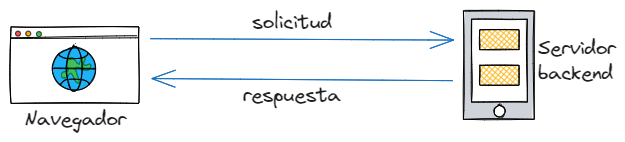
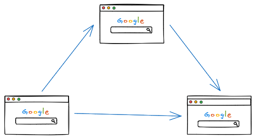
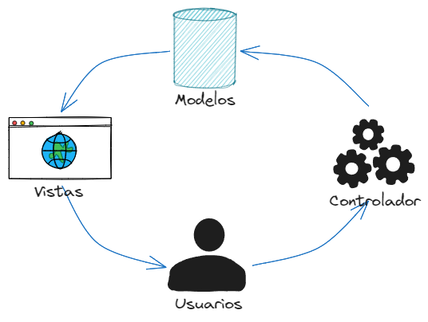
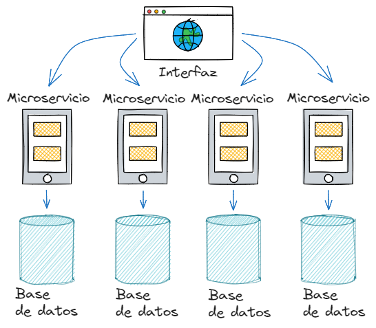
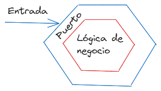

# Arquitectura de software

## ¿Qué es la arquitectura de software?

La arquitectura de software describe componentes principales, su relacion y cómo interactuan entre sí. La arquitectura de software es importante porque es la base para la planificación, la implementación y la genstión de un proyecto de software.

**Puntos clave**

- La arquitectura de software debe definir una solución para cumplir con todos los requisitos técnicos y operativos, con el objetivo común de optimizar el rendimiento y la seguridad.

- El diseño de la arquitectura implica las necesidades del negocio y las del equipo de desarrollo. Cada desición puede tener un impacto considerable en la calidad, mantenibilidad, rendimiento, escalabilidad y seguridad del software.

## Patrones de arquitectura de software

### 1. Client-Server

La arquitectura funciona sobre un modelo de solicitud-respuesta. El cliente envía una solicitud al servidor y el servidor responde a la solicitud.

Cada sition web o aplicaciones como Facebook, Instagram, Twitter, etc. utilizan la arquitectura cliente-servidor.



### 2. Peer-to-peer (P2P)

Una red P2P es una red de computadoras en la que cada computadora actúa como un nodo que comparte recursos con otros nodos de la red. Los nodos actúan como clientes y servidores al mismo tiempo. Esta es la base de la tecnología blockchain.



### 3. Model-View-Controller (MVC)

La arquitectura MVC es un patrón en la que la lógica de la aplicación se divide en tres componentes sobre la base de la funcionalidad.

**Modelos**: Representan los datos de la aplicación y las reglas de negocio.

**Vistas**: Representan la interfaz de usuario. Los componentes que son visibles para el usuario.

**Controladores**: Los componentes que actúan como un intermediario entre modelos y vistas.



### 4. Microservicios

Es una arquitectura en la que la aplicación se divide en un conjunto de tareas pequeñas que a su vez se dividen en módulos. Cada servicios se encarga de una función específica y se comunica con otros servicios a través de una API. Todo en conjunto forma una aplicación o un servicio completo.

Esta arquitectura facilita el mantenimiento de la aplicación, el desarrollo y la escalabilidad.



### 5. Hexagonal

La arquitectura hexagonal es un patrón de diseño de software que permite la creación de aplicaciones independientes del framework. La lógica de la aplicación se encuentra en el centro y se comunica con el mundo exterior a través de puertos.

Tiene tres partes:

- Puertos
- Adaptadores
- Lógica de negocio

El objetivo de esta arquitectura es hacer que los diferentes componentes de la aplicación sean independientes entr sí o ligeramente acoplados.



## ¿Cuántas capas debe tener mi aplicación?

### De una sola capa
***Props***
- Sin latencia de red.
- Los datos están disponibles en la misma máquina.
- Los datos son fáciles de compartir.

***Contras***
- Poco control sobre la aplicación (Es dificil de implementar nuevas funcionalidades).
- Las pruebas deben ser extremadamente detalladas con poco lugar a errores.
- Las aplicaciones de un solo nivel son vulnerables a hackeo o modificaciones.

### De dos capas
***Props***
- Separación de la lógica de negocio y la interfaz de usuario.
- Fácil de mantener y probar
- Escalabilidad.

***Contras***
- La lógica de negocio y la interfaz de usuario están acopladas.
- No es fácil de mantener a medida que la aplicación crece, porque las versiones de la aplicación deben avtualizarse en todos los clientes.
- Es dificil reutilizar la lógica de negocio.

### De tres capas o mas capas
***Props***
- Separación de la lógica de negocio, la interfaz de usuario y la base de datos.
- Escalabilidad.
- Facil de mantener y probar.

***Contras**
- La lógica de negocio y la interfaz estan acopladas.
- Cuando la aplicación tiende a crecer demasiado no es fácil de mantener, porque las versiones de la aplicación deben actualiar en todos los clientes.
- Aumenta la latencia porque los servidores deben conectarse entre sí.

## Escalabilidad

### Aplicación vertical

La escalabilidad vertical es la capacidad de procesamiento de un servidor o máquina. Es se logra añadiendo mas CPU, RAM, almacenamiento, etc.

### Aplicacion horizontal

La escalabilidad horizontal es la capacidad de aumentar la capacidad de procesamiento de una aplicación distribuyendo la carga en varios servidores o máquinas.

## ¿Monolito o microservicios?

### Monolito

**Pros**
- Fácil de desarrollar.
- Fácil de probar.
- Fácil de implementar.

**Contras**
- Dificil de mantener.
- Dificil de escalar.
- Dificil de implementar nuevas funcionalidades.
- Dificil de implementar nuevas tecnologías.

### Microservicios

**Pros**
- Fácil de mantener.
- Fácil de escalar.
- Fácil de implementar nuevas funcionalidades.

**Contras**
- Dificil de desarrollar.
- Dificil de probar.
- Dificil de implementar.

## Estructura de carpetas para un proyecto de software

```bash
project
├── README.md
├── ...
├── controllers     # Toda la lógica de negocio
│   └── example_controller.py
├── models          # Modelos de la base de datos
│   └── example_model.py
├── routes          # Rutas de la aplicación
│   └── example_router.py
├── config          # Configuración del proyecto
│   └── config.py
└── utils           # Funciones de utilidad
   └── example_utils.py
```

```bash
project
├── README.md
├── ...
└── app
    ├── ventas
    │   ├── controllers
    │   │   └── ventas_controller.py
    │   ├── models
    │   │   └── ventas_model.py
    │   ├── routes
    │   │   └── ventas_router.py
    │   └── utils
    │       └── ventas_utils.py
    ├── usuarios
    │   ├── controllers
    │   │   └── usuarios_controller.py
    │   ├── models
    │   │   └── usuarios_model.py
    │   ├── routes
    │   │   └── usuarios_router.py
    │   └── utils
    │       └── usuarios_utils.py
    └── config
        └── config.py

```